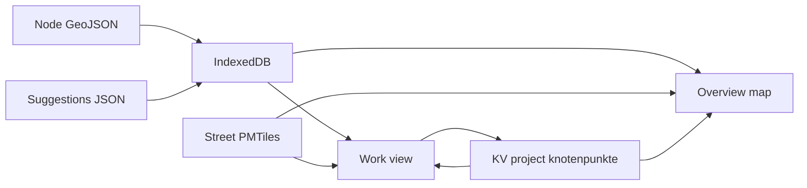

# Knotenpunkte rating app

Build a new FixMyCity SPA in the empty workspace [`/Users/tordans/Development/FMC/knotenpunkte`](/Users/tordans/Development/FMC/knotenpunkte). It is the junction-rating counterpart of [parkraum-zaehlung](file:///Users/tordans/Development/FMC/parkraum-zaehlung): same stack and shell, a different task.

## Name

Repo, folder, npm name, KV project slug, and GitHub Pages base path: **`knotenpunkte`** (`/knotenpunkte/`). The folder is already this workspace. App title: **Knotenpunkte**.

A campaign is an area slug (same rule as Parkraum: `^[a-z0-9]+(-[a-z0-9]+)*$`, 3–60 chars, stable, no date). Berlin Infravelo is the first campaign.

## What the user does

1. Pick or create an area slug and upload the node file. A suggestion file for that area is optional.
2. Land on the next **unrated** node. The map shows that one point plus the official street network, colored by StEP class.
3. Capture the Zustand-nach-OSM attributes with keys or buttons. Suggested answers are already filled and can be skipped. Enter saves and jumps to the next unrated node.
4. Open a full edit mask for every field, or an overview map of all nodes colored by status. Clicking a point opens it in the work view.
5. A different person can confirm a rating or mark it problematic, then must submit a corrected rating. The entry stays completed. The original rater cannot run QA on their own row. Names listed in an admin file can always run QA, including on their own rows, so the flow can be tested.

## Data contracts

Two different files explain two different jobs.

**Input nodes** — [`strassennetz-berlin-verbindungspunkte-mit-id`](file:///Users/tordans/Development/FMC/tilda-static-data/geojson/region-berlin/strassennetz-berlin-verbindungspunkte-mit-id): `Point`, stable id in `NUMMER` (example `42540040`), plus `OKSTRA_ID`.

**Result shape** — [`infravelo-datensatz-knoten-fortlaufend`](file:///Users/tordans/Development/FMC/tilda-static-data/geojson/region-berlin/infravelo-datensatz-knoten-fortlaufend) is what a finished feature looks like, and which properties this app adds. Importer accepts `NUMMER` or `Knotenpunkt-ID`. The result file’s id key uses a Unicode hyphen (`Knotenpunkt‐ID`, U+2010); accept that too.

Button titles come from the capture spec “23. Zustand nach OSM”. Stored keys stay identical so GeoJSON export matches the result file. The Knoten [`meta.ts`](file:///Users/tordans/Development/FMC/tilda-static-data/geojson/region-berlin/infravelo-datensatz-knoten-fortlaufend/meta.ts) legend is the overview color language (Fertig, Übersprungen, Offen, Virtuell).

Shown read-only from the uploaded point, not entered:

- Laufende Nummer — `NUMMER` or `Knotenpunkt-ID`
- Referenz im Detailnetz — `okstra_id`
- Bezirksnummer — `Bezirksnummer`
- Radverkehrsnetz — `ist_radvorrangnetz`

Captured in the rapid form. A node is complete when it is skipped, or all seven answers are set. Three-level values stay `keine` | `teilweise` | `gänzlich`. Binary values stay `0` | `1`, labeled Nein and Ja.

- Knotenpunkt mit Hauptverkehrsstraße (HVS) — `KP_HVS` — Nein / Ja
- LSA-Knotenpunkt — `LSA_KP` — Nein / Ja
- Markierte Radverkehrsfurten im Knotenpunkt — `Mar_RVF_KP` — keine / teilweise / gänzlich
- Rotmarkierung der Furt — `Furt_rot` — keine / teilweise / gänzlich
- Radfahrstreifen in Mittellage — `RFS_Mitte` — keine / teilweise / gänzlich
- Rad-Aufstellflächen für Linksabbiegen vorhanden — `Fl_Linksab` — keine / teilweise / gänzlich
- Vorgezogene Aufstellflächen vorhanden — `vorgez_Fl` — keine / teilweise / gänzlich

Also stored: `KP_Nichtbetrachten` (`0` considered, `1` skipped; a skipped node keeps the seven answers empty), `ist_virtuell` (`0` | `1`), `Mapillary-ID`, `Kommentar`. Skip is a rapid key. Virtual, Mapillary, and comment are edited in the full mask. Completeness ignores them.

**Streets** — static layer, the dataset TILDA serves for Infravelo:

- Tile URL: `https://tilda-geo.de/api/uploads/strassennetz-berlin-strassenabschnitte.pmtiles` (the `data=["strassennetz-berlin-strassenabschnitte"]` layer on [tilda-geo.de/regionen/infravelo](https://tilda-geo.de/regionen/infravelo?map=14.6/52.5076/13.3115&bg=default&bg3d=false&osmNotes=false&notes=false&qa=&config=l6jzgk.5ount0.4&v=2&data=%5B%22strassennetz-berlin-strassenabschnitte%22%5D))
- MapLibre vector source `pmtiles://` that URL, `source-layer: default`, same as [SourcesLayersStaticDatasets.tsx](file:///Users/tordans/Development/FMC/tilda-geo--infravelo/app/src/components/regionen/pageRegionSlug/Map/SourcesAndLayers/SourcesLayersStaticDatasets.tsx). Register the `pmtiles` protocol once, as in that app’s `MapInterface`.
- Paint, legend, and attribution copied into a small const from [`meta.ts`](file:///Users/tordans/Development/FMC/tilda-static-data/geojson/region-berlin/strassennetz-berlin-strassenabschnitte/meta.ts). Color is `match` on `strassenklasse1`:

  - StEP I: großräumige Straßenverbindung — `#194294`
  - StEP II: übergeordnete Straßenverbindung — `#4498F8`
  - StEP III: örtliche Straßenverbindung — `#EA3323`
  - StEP IV: Ergänzungstraßen — `#3D5C17`
  - V: Keine StEP Stufe — `#75FB4C`

The layer is always on in the work view and the overview. Attribution: Geoportal Berlin / Detailnetz Berlin Straßenabschnitte, licence DL-DE/BY-2.0.

**Suggestions** (optional, per area) — JSON array, replaced on re-upload:

- `id` (node id), `attribute` (one of the stored keys), `value`, `confidence` (0–1)

On an unrated node, every suggestion is prefilled and the rapid cursor jumps to the first empty attribute. If all seven are suggested, Enter accepts them and advances. The saved record keeps the final value plus, for each suggested attribute, `{ suggested, confidence, accepted }`. The work panel calls out mismatches (“Vorschlag A, gewählt B”).

**Rating record** in the KV entry (public read, OSM Bearer write), id prefix `{area}:{nodeId}`:

- final attribute values
- suggestion audit as above
- `created_by` frozen, `created_at`, `updated_by`, `updated_at`
- `status`: `complete` once skipped or all seven Zustand-nach-OSM attributes are set
- `qa`: `none` | `confirmed` | `corrected`
- `history[]`: `{ at, by, kind: 'save' | 'confirmed' | 'corrected', previous, next }`

A correction appends history and leaves the node complete. The panel shows the sentence the transcript asked for: user A chose the old values; user B marked it problematic and set the new values.

## Screens

URL state follows Parkraum (`map`, `dataset`, `bg`) plus `node`, `view=work|overview`, and `status` filter.

- **Dataset** — slug, node file picker, optional suggestion file picker, inventory of local areas vs remote ratings.
- **Work** (default) — one node, category buttons, skip, save-and-next, progress `rated/total`, full mask, QA actions, history. Filter defaults to unrated.
- **Overview** — all uploaded nodes, circle style in the language of the Knoten [`meta.ts`](file:///Users/tordans/Development/FMC/tilda-static-data/geojson/region-berlin/infravelo-datensatz-knoten-fortlaufend/meta.ts) legend (radius, stroke, halo). Unrated orange `#f59e0b`, complete green `#22c55e`, skipped gray `#6b7280`, virtual purple `#a855f7`, confirmed darker green stroke, corrected sky `#38bdf8`. Same `status` filter as the work list. Click flies into work view. Labels of node id from zoom 15, as in that meta file.
- **Export** — JSON of full records (audit included); GeoJSON of local points with the result-file properties plus `qa` and a short correction summary.
- **`/data`** — every KV rating for the project, no local file required. Same idea as Parkraum’s Zähl-Datenbank page.

Keyboard (ignored while a text field is focused, same guard as Parkraum): two keys for each Ja/Nein row, three keys for each keine/teilweise/gänzlich row, one skip key, Enter save-and-next, and previous/next along the current filter. The German labels on the buttons show the key caps.

QA buttons “Bestätigen” and “Problematisch” are disabled when the logged-in OSM display name equals `created_by`, unless that name is in [`src/config/admins.const.ts`](src/config/admins.const.ts). Start that list with the Parkraum admin names (`tordans`, `Supaplex030`). This is a UI guard only, same limitation as Parkraum super-admins: the worker checks write access, not this list. “Problematisch” opens the full mask and requires a submitted correction before the history row is written.

## Basemap

Keep Parkraum’s background control: OpenFreeMap Positron, plus the Editor Layer Index list for the current country, choice stored in `bg`.

Add a private raster URL (`{z}/{x}/{y}` template). It is saved in **localStorage** only, never in git, KV, or exports. Once set, it becomes the default for this browser; `bg` can still select Positron or an ELI layer. The control states that the key inside the URL stays on this machine.

Node GeoJSON and suggestion JSON go in **IndexedDB** (`idb-keyval`). The private tile URL goes in **localStorage**.

## Shell taken from Parkraum

- Bun, Vite, React 19, TanStack Router and Query, Zustand where Parkraum uses it, Tailwind, Zod 4, react-map-gl / MapLibre, Vitest, Playwright smoke, oxlint/oxfmt, AGPL, GitHub Pages
- Header, step nav, resizable sidebar, OSM login button, callouts
- OSM OAuth 2 PKCE, `read_prefs`, non-confidential client, land page. New OAuth app and redirect URIs. Dev server on fixed port `33480`
- Vendored KV client at `https://key-value-store.fixmycity.workers.dev`, project `knotenpunkte`, its own public `X-Api-Key` in `app.const.ts`. Reads are public. Writes send the OSM token. The area slug is the entry prefix
- File import, slug confirm, IndexedDB replace-on-reimport, progress, `/data` table, JSON/GeoJSON export, `created_by` frozen
- Map URL camera, reset north/pitch, ELI background list, hotkeys that yield to text fields
- Admin names in a committed const file

## README

[`README.md`](README.md) is the documentation of the app. It describes what this repo builds and how the workflows run. It stays aligned with the UI: when a workflow changes, the same change updates the README. English, with the German labels the app shows.

Sections:

- **What this is** — a web mask to rate junction nodes, one node after another. Campaigns are area slugs. Berlin Infravelo is the first campaign. Ratings go to the shared database under KV project `knotenpunkte`.
- **Run** — `bun install`, `bun run dev` on `http://127.0.0.1:33480`, `bun run check`. OSM login needs the redirect URIs for that port and for `https://fixmyberlin.github.io/knotenpunkte/`.
- **Rate** — upload a node GeoJSON (`NUMMER` or `Knotenpunkt-ID`), confirm the area slug, then the next unrated node. The map shows that point and the StEP street layer. Seven attributes (two Ja/Nein, five keine/teilweise/gänzlich), skip, Enter saves and advances. List the keys next to the labels.
- **Suggestions** — optional JSON per area (`id`, `attribute`, `value`, `confidence`). Prefilled answers can be accepted with Enter. A mismatch is stored and shown as suggestion versus chosen value.
- **Full mask** — every stored field, including virtual, Mapillary, and comment.
- **Overview** — all nodes colored like the Knoten legend, same status filter as the work list, click opens the work view.
- **Review** — Bestätigen, or Problematisch plus a corrected rating. The node stays complete. History names who set the old values and who corrected them. The original OSM user does not get these actions; names in `src/config/admins.const.ts` do.
- **Export and data** — JSON with audit, GeoJSON with the result-file properties, and `/data` for every rating without the local file.
- **Map** — OpenFreeMap Positron, ELI backgrounds, and a private raster URL kept in this browser. Once set, that URL is the default here.
- **Storage** — nodes and suggestions in IndexedDB; ratings in the KV database (public read, OSM login to write); private tile URL in localStorage.
- **Attributes** — the seven Zustand-nach-OSM titles with their stored keys, plus skip, virtual, Mapillary, and comment. A node is complete when it is skipped or all seven answers are set.

## Provisioning before the first save works

- OSM OAuth app with `http://127.0.0.1:33480/osm-oauth-land.html` and `https://fixmyberlin.github.io/knotenpunkte/osm-oauth-land.html`
- Worker project `knotenpunkte` and its public API key in `src/config/app.const.ts`. The private tile URL stays in the browser

## Build order

1. Scaffold the stack and shell from Parkraum (auth, KV client, IndexedDB import, map, ELI backgrounds, export, `/data`).
2. Node import, rapid rating of the seven Zustand-nach-OSM attributes, skip, save, auto-advance through unrated nodes.
3. Always-on street PMTiles layer, StEP paint, and legend.
4. Private basemap URL.
5. Suggestions upload, prefill, mismatch audit.
6. Full edit mask.
7. Overview map, shared status filter, click-through.
8. QA confirm / correct, history text, admin bypass, filters for confirmed and corrected.
9. README sections land with the workflow they describe, starting from the scaffold. The finished README matches the sections above.
